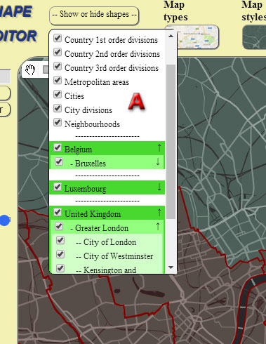
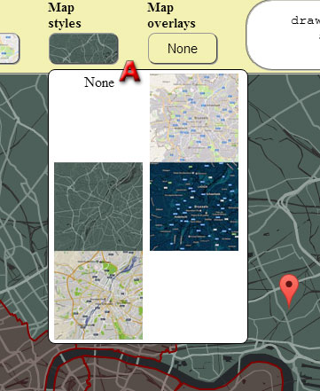
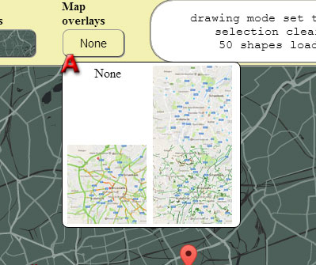
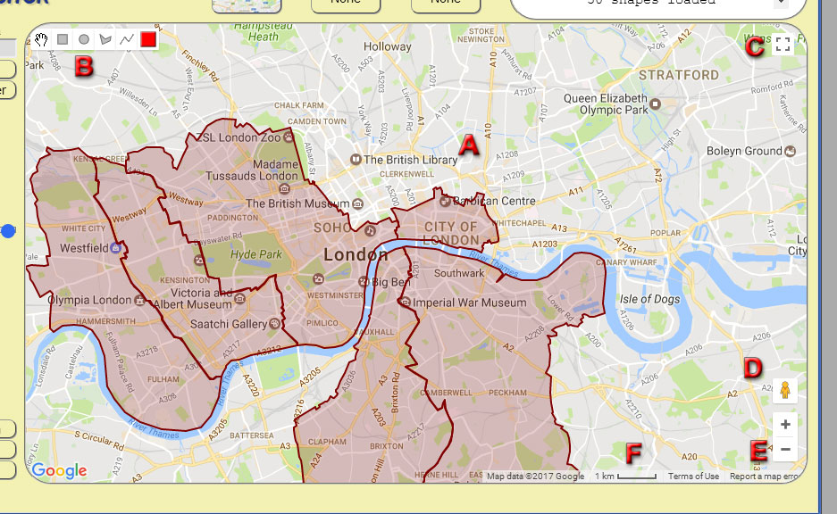
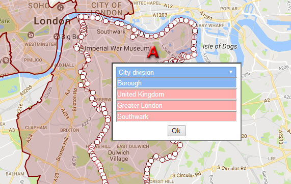
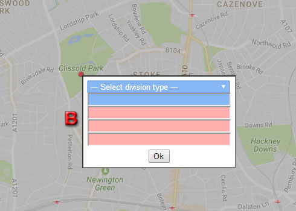

# 1. Contents

1. [Contents](README.md#1-contents)
2. [Shape editor](README.md#2-shape-editor)
3. [Installation](README.md#3-installation)
4. [Usage](README.md#4usage)
    * [User Interface](README.md#user-interface)
        * [Header](README.md#header)
        * [Show or hide shapes](README.md#show-or-hide-shapes)
        * [Map types](README.md#Map-types)
        * [Map styles](README.md#Map-styles)
        * [Map overlays](README.md#Map-overlays)
        * [Message box](README.md#Message-box)
        * [Left panel](README.md#Left-panel)
        * [Map section](README.md#Map-section)
    * [Creating a shape](README.md#Creating-a-shape)
    * [Creating a marker](README.md#Creating-a-marker)
5. [Personalising](README.md#5-personalising)
    * [Custom marker icons](README.md#Custom-marker-icons)
6. [To do list](README.md#6-to-do-list)
7. [Known issues](README.md#7-known-issues)
8. [Version](README.md#8-version)
9. [License](README.md#9-license)

# 2. Shape editor
Shape editor allows you to create shapes and markers on Google Maps, customising them, and organising them before saving them on a Json file. These shapes are aimed to represent geographical and political divisions such as States, City Neighbourhoods, Districts, Regions, etc.

# 3. Installation
Clone or Download.
Get your Google Maps API key [here](https://developers.google.com/maps/documentation/javascript/get-api-key), and use it on the following lines of code by replacing "INSERT-YOUR-API-KEY-HERE" with your API key:

**On index.php**
````Javascript
<!--External JS-->
  <script src="//code.jquery.com/jquery-latest.min.js" type="text/javascript"></script>
  <script src="https://maps.googleapis.com/maps/api/js?key=INSERT-YOUR-API-KEY-HERE&libraries=drawing"></script>
  <script type="text/javascript" src="js/shape-editor.js"></script>
````
**On shape-editor.js**
````Javascript
// Changes the location of the maps
  function changeLocation() {
    document.getElementById("lastSearch").value = base_location.value;
    document.getElementById("map_embed").src = "https://www.google.com/maps/embed/v1/place?key=INSERT-YOUR-API-KEY-HERE&q=" + (base_location.value).replace(" ", "+");
````

**On shape-editor.js**
````Javascript
// Map creation
   function createMap(mapContainer) {
      // Creates base map
         document.getElementById("map_embed").src = "https://www.google.com/maps/embed/v1/place?key=INSERT-YOUR-API-KEY-HERE&q=" + base_location.value;
````

# 4. Usage

There are two maps on the map section - A base map with an overlay map on top.
The base map is able to show city boundaries upon a search, whereas the overlay map isn't. Combining the two maps this way, you are able to effectively copy those boundaries onto your custom shapes created on the overlay map.

* ## User Interface
* #### Header


_**A-**_ Dropdown menu which allows you to show or hide the shapes you have created. This menu will be filled up as you create your shapes and markers.

_**B-**_ This is where you can select the type of map your overlay map is.

_**C-**_ This is where you can select the style applied to the overlay map.

_**D-**_ This is where you can select an overlay for your overlay map.

_**E-**_ This message box logs your actions on the editor.

* ##### Show or hide shapes



_**A-**_ As you create new shapes, new items and categories will be created on this dropdown, allowing you to filter in or out your shapes the way you prefer it.

* ##### Map types


_**A-**_ Map types include "Roadmap" (the default map type), "Satellite", "Hybrid", and "Terrain".

* ##### Map styles



_**A-**_ Map styles are custom ways of displaying your maps by altering Options parameters such as primary roads fill and stroke colour for example.

* ##### Map overlays



_**A-**_ Map overlays are displayed as an overlay of your map. Included are "Transit", "Traffic", and "Bike".

* ##### Message box


_**A-**_ Your actions on Shape Editor are logged on the Message Box.

* #### Left panel


_**A-**_ Maps location allows you to search for a new location on both maps simultaneously. Each map search results in a marker being displayed on the map, which can be removed by clicking the "Clear marker" button.

_**B & C-**_ The Overlay map section allows you to control the opacity* of the overlay map, the colour of your shapes, and the thickness of their borders.

_**D-**_ Delete the selected shape or marker, delete all shapes and markers, or save them all.

_*Note:_ In order to be able to move around on the base map, the opacity of the overlay map should be set to zero by sliding the blue handle all the way to the left.

* #### Map section



_**A-**_ Main map section.

_**B-**_ Shape controls.

_**C-**_ Full screen option.

_**D-**_ Street view mode.

_**E-**_ Zoom controls.

_**F-**_ Current scale.

* ## Creating a shape


_**A-**_ Create shapes easily the way you like.



_**A-**_ When clicking on a shape on the map, you can easily edit all its points, and all its names.

* ## Creating a marker


_**A-**_ Creating markers is just as easy. A dropdown menu lets you choose from a list of different marker icons, which you can modify as you wish.



_**A-**_ Fill in the marker properties in order to finish creating your marker.

# 5. Personalising
* ## Custom marker icons

Any custom icons you would like to use for your markers can be added to the folder "markers" located inside the folder "images". The code will detect them and insert them into the dropdown automatically.

# 6. To do list

* Add CSS media queries to allow responsiveness on smaller devices.

# 7. Known issues


# 8. Version

1.0

# 9. License

[MIT License](LICENSE)
